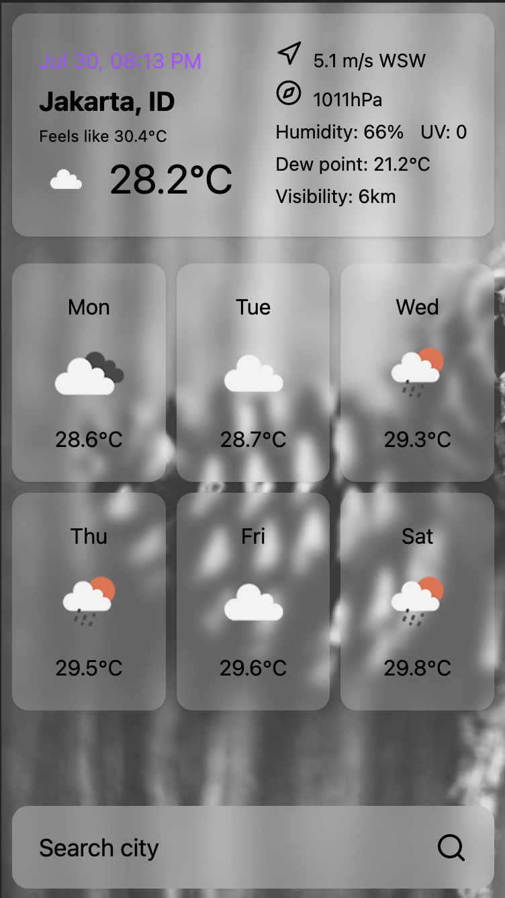

# Weather App

It is just Weather App, don't expect anything!

<div style="text-align: center;"></div>

## References

- https://gramedia.com

## Links

Production:

- `https://weather-app-ericprd.vercel.app`

Local:

- `http://127.0.0.1:5173/`

## Tech Stack

- HTML
- CSS
  - Tailwind CSS
- JavaScript
  - TypeScript
- Node.js & npm
- React v18
- Data Fetching
  - REST API: `axios`
- Misc
  - Prettier
  - ESLint
  - Vite

## Development

Clone project

```sh
git clone github.com/ericprd/weather-app
```

Install dependencies:

```sh
npm install
```

Run server in development mode:

```sh
npm run dev
```

Build for production:

```sh
npm run build
```

Start in production mode:

```sh
npm run preview
```
